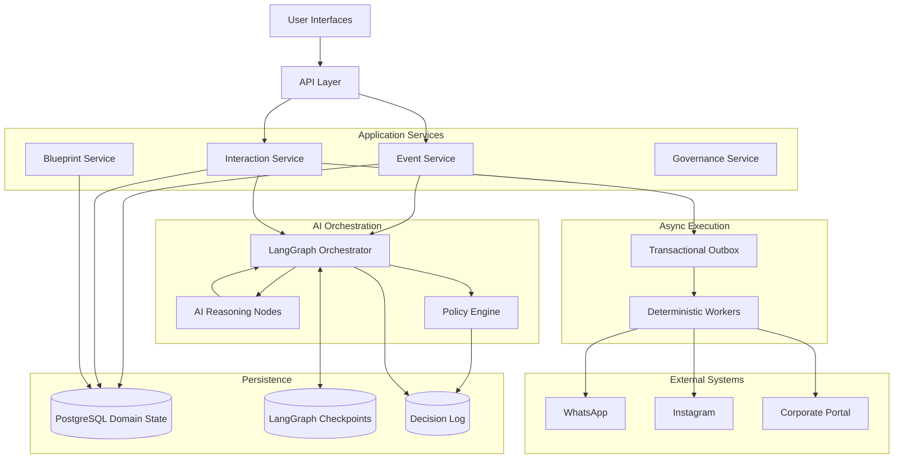

# Architecture Overview

## Architecture Layers

The AI Event Platform is organized into layered domains that separate orchestration, interaction, governance, and modular event orchestration capabilities.

### Client Layer
Interfaces used by operators, stakeholders, and participants.

Components:
- Dashboard UI
- Approval UI
- AI Copilot Interface

---

### Application Services Layer

Core business services responsible for event lifecycle management.

#### Event Service
Manages event blueprints, stages, and execution lifecycle.

#### Blueprint Service
Manages reusable event workflow structures and event blueprint definitions.

#### Interaction Service
Processes real-time interactions, approval workflows, and external communication pipelines.

#### Governance Service
Provides auditability, RBAC, compliance controls, and policy enforcement.

---

### AI Orchestration Layer

Coordinates deterministic AI-assisted workflows using LangGraph orchestration.

Components:
- LangGraph Orchestrator
- AI Reasoning Coordination
- Shared Workflow State

---

### Shared State & Decision Layer

Stores orchestration state, interaction state, and decision logs used by orchestration workflows and governance processes.

Components:
- Event State
- Interaction State
- Decision Log
- Audit Records

---

### Integration Layer

Handles communication with external platforms and systems.

Components:
- WhatsApp Integration
- Instagram Integration
- Internal Portal Integration
- Webhook Adapters

## Components

The platform is built around several key components that work together to achieve its goals.

- **Event Service**: Manages event blueprints and event lifecycle orchestration.
- **Blueprint Service**: Manages reusable workflow structures and event blueprint definitions.
- **Interaction Service**: Facilitates real-time and approval-based interactions.
- **Governance Service** ensures compliance, auditability, RBAC enforcement, and policy validation across orchestration workflows.
- **AI Orchestration Layer**: Coordinates deterministic AI-assisted workflows using LangGraph orchestration.

## System Flow

The AI Event Platform follows a structured flow to ensure seamless event orchestration:

1. **Event Creation**:
   - The **Event Service** creates an event blueprint, which includes modular stages.
   - The **Blueprint Service** manages reusable workflow structures and event blueprint definitions.

2. **Real-time Interactions**:
   - The **Interaction Service** handles real-time interactions using the **Interaction Engine**, which supports both real-time and approval-based processes.
   - The **Governance Service** ensures compliance, auditability, RBAC enforcement, and policy validation across orchestration workflows.

3. **Orchestration**:
   - The **AI Orchestration Layer** uses LangGraph for deterministic orchestration, coordinating deterministic orchestration workflows efficiently.

## Shared State & Decision Log

Stores event state, interactions, and audit records used by orchestration workflows and governance processes.

---

## State Ownership Model

The AI Event Platform separates orchestration state from domain state to ensure deterministic execution and clear ownership boundaries.

### Orchestration State

Owned by the LangGraph Orchestrator.

Stores:
- workflow execution state
- stage transitions
- reasoning coordination state
- orchestration checkpoints

### Domain State

Owned by application services.

Examples:
- Event Service owns event lifecycle data
- Interaction Service owns interaction processing data
- Governance Service owns audit and approval records

### Shared Decision Log

Used across orchestration and services to provide:
- traceability
- auditability
- replay support
- governance visibility

---

## Mermaid Diagram

## Status

Architecture and design phase.
Implementation starting soon.