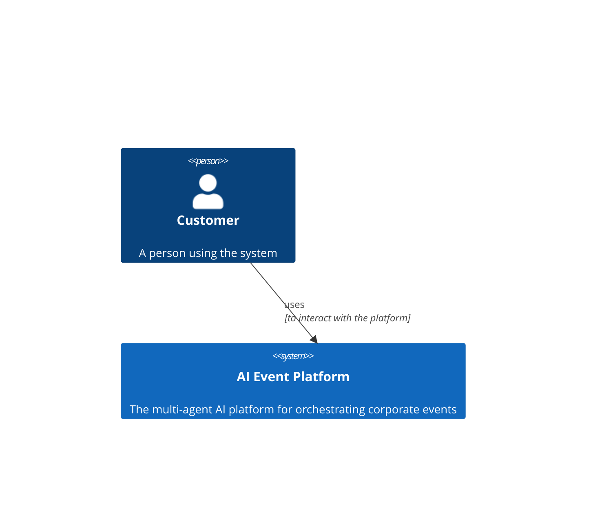

# C4 Context Diagram

```mermaid
C4Context
  Person(customer, "Customer", "A person using the system")
  System(system, "AI Event Platform", "The multi-agent AI platform for orchestrating corporate events")

  Rel(customer, system, "uses", "to interact with the platform")
```

## Status

[Insert current status here, e.g., "In Development", "Alpha", etc.]
