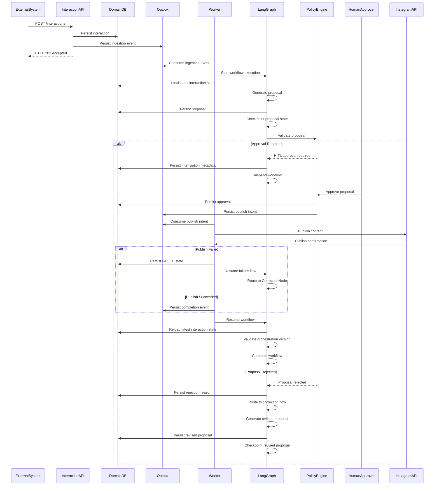

# Interaction Flow

## Overview

This sequence describes the end-to-end orchestration flow for the initial vertical slice.

The workflow demonstrates:
- asynchronous ingestion
- deterministic governance
- HITL approvals
- orchestration suspend/resume
- proposal persistence
- replay-safe execution
- asynchronous side-effect execution

---

