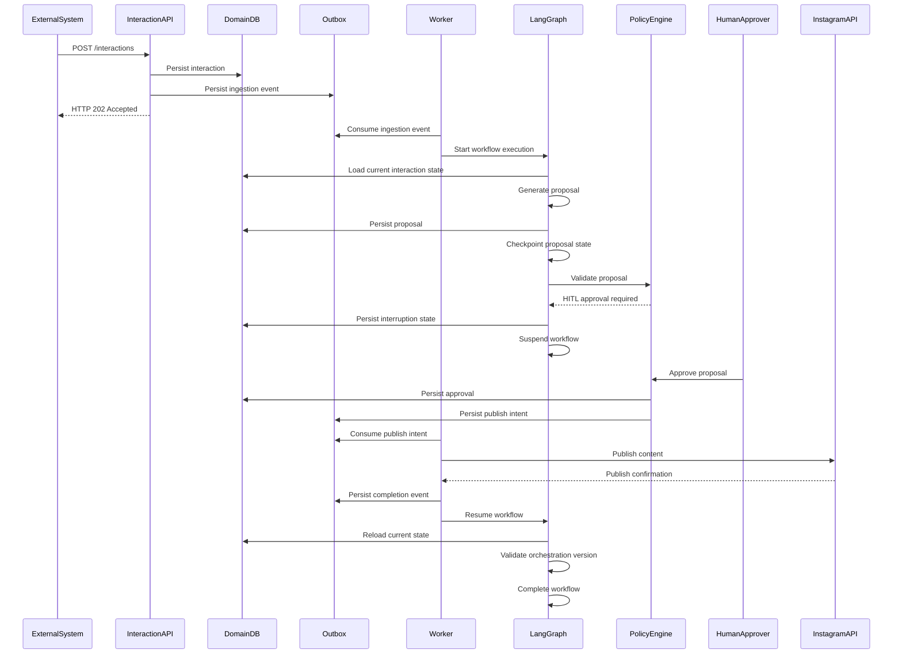

# Interaction Flow

## Overview

This sequence describes the end-to-end asynchronous interaction workflow for the initial vertical slice.

The workflow demonstrates:
- asynchronous ingestion
- deterministic governance
- HITL approvals
- orchestration suspend/resume
- outbox execution
- external integration isolation

---

