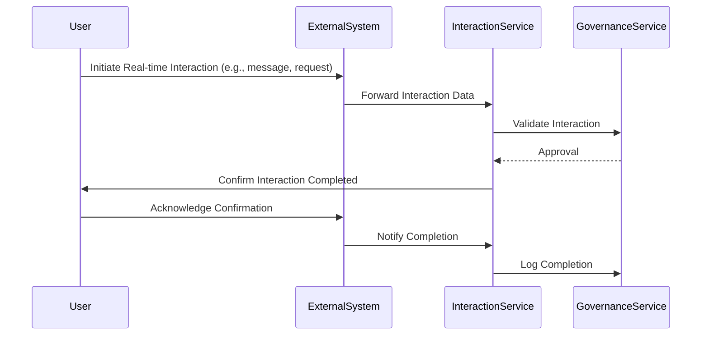

# Interaction Flow Sequence Diagram

```mermaid
sequenceDiagram
    participant User
    participant ExternalSystem
    participant InteractionService
    participant GovernanceService

    User->>ExternalSystem: Initiate Real-time Interaction (e.g., message, request)
    ExternalSystem->>InteractionService: Forward Interaction Data
    InteractionService->>GovernanceService: Validate Interaction
    GovernanceService-->>InteractionService: Approval
    InteractionService->>User: Confirm Interaction Completed
    User->>ExternalSystem: Acknowledge Confirmation
    ExternalSystem->>InteractionService: Notify Completion
    InteractionService->>GovernanceService: Log Completion
```